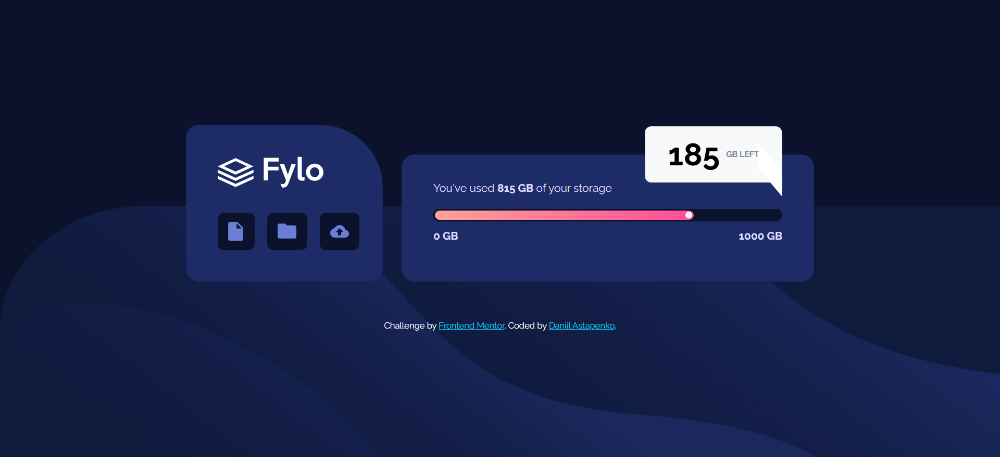

# Frontend Mentor - Fylo data storage component solution

This is a solution to the [Fylo data storage component challenge on Frontend Mentor](https://www.frontendmentor.io/challenges/fylo-data-storage-component-1dZPRbV5n). Frontend Mentor challenges help you improve your coding skills by building realistic projects.

## Table of contents

-   [Overview](#overview)
    -   [The challenge](#the-challenge)
    -   [Screenshot](#screenshot)
    -   [Links](#links)
-   [My process](#my-process)
    -   [Built with](#built-with)
    -   [What I learned](#what-i-learned)
    -   [Continued development](#continued-development)
    -   [Useful resources](#useful-resources)
-   [Author](#author)

## Overview

### The challenge

Users should be able to:

-   View the optimal layout for the site depending on their device's screen size

### Screenshot

### Links

-   Solution URL: [GitHub repository](https://github.com/h0ldemslav/frontend-mentor-challenges/tree/master/junior/fylo-data-storage-component-master)
-   Live Site URL: [GitHub Pages](https://h0ldemslav.github.io/frontend-mentor-challenges/junior/fylo-data-storage-component-master/index.html)

## My process

### Built with

-   [Bootstrap](https://getbootstrap.com) - CSS framework
-   CSS custom properties
-   Mobile-first workflow

### What I learned

In this challenge I mainly wanted to practice my CSS skills using a CSS framework - Bootstrap. So the biggest outcome is that now I'm way more familiar with the framework and feel ready to use in my future projects, if there is a need.

### Continued development

Use more CSS frameworks, they're very convenient and suggest using some interesting approaches. Though it's still good to remember and practice the basics of CSS (helped me throughout this challenge when I was writing additional styles).

### Useful resources

-   [HTML validator](https://validator.w3.org/#validate_by_input)
-   [CSS validator](https://jigsaw.w3.org/css-validator/validator.html.en#validate_by_input)
-   [MDN docs](https://developer.mozilla.org/en-US/)
-   [Bootstrap docs](https://getbootstrap.com/docs/5.3/getting-started/introduction/)

## Author

-   GitHub - [h0ldemslav](https://github.com/h0ldemslav)
-   Frontend Mentor - [@h0ldemslav](https://www.frontendmentor.io/profile/h0ldemslav)
