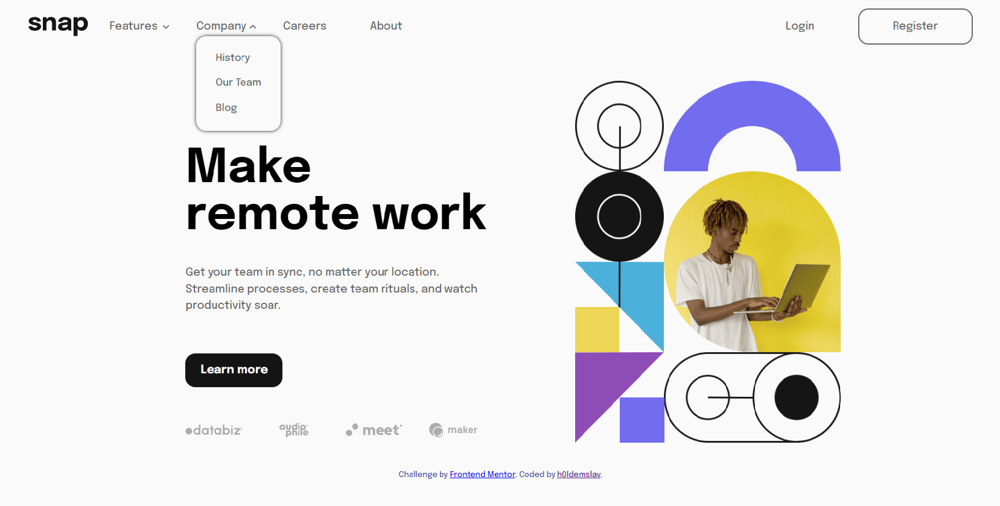

# Frontend Mentor - Intro section with dropdown navigation solution

This is a solution to the [Intro section with dropdown navigation challenge on Frontend Mentor](https://www.frontendmentor.io/challenges/intro-section-with-dropdown-navigation-ryaPetHE5). Frontend Mentor challenges help you improve your coding skills by building realistic projects. 

## Table of contents

- [Overview](#overview)
  - [The challenge](#the-challenge)
  - [Screenshot](#screenshot)
  - [Links](#links)
- [My process](#my-process)
  - [Built with](#built-with)
  - [What I learned](#what-i-learned)
  - [Continued development](#continued-development)
  - [Useful resources](#useful-resources)
- [Author](#author)
- [Acknowledgments](#acknowledgments)

## Overview

### The challenge

Users should be able to:

- View the relevant dropdown menus on desktop and mobile when interacting with the navigation links
- View the optimal layout for the content depending on their device's screen size
- See hover states for all interactive elements on the page

### Screenshot



### Links

- Solution URL: [GitHub repository](https://github.com/h0ldemslav/frontend-mentor-challenges/tree/master/junior/intro-section-with-dropdown-navigation-main)
- Live Site URL: [GitHub Pages](https://h0ldemslav.github.io/frontend-mentor-challenges/junior/intro-section-with-dropdown-navigation-main/)

## My process

### Built with

- Semantic HTML5 markup
- CSS3
- [BEM](https://en.bem.info/methodology/quick-start/) (only CSS)
- Mobile-first workflow
- JavaScript

### What I learned

This time I've learned how to use media queries in JavaScript, which is pretty simple. Below is a snippet, which detects screen's width and hides or shows the burger menu button. It also edits header's navigation menu style classes depending on a screen (mobile/desktop).

```js
const mediaQuery = window.matchMedia("(min-width: 768px)");

function handleQuery(e) {
    if (e.matches) {
        burgerButton.classList.add(styleClasses.hidden);
        headerMenu.classList.remove(styleClasses.headerMenu);
        headerMenu.classList.remove(styleClasses.hidden);

        previewSectionImage.src = mediaPaths.previewImageDesktop;
    } else {
        burgerButton.classList.remove(styleClasses.hidden);
        
        if (!burgerButton.classList.contains(styleClasses.burgerButtonExpanded)) {
            headerMenu.classList.add(styleClasses.hidden);
        }

        headerMenu.classList.add(styleClasses.headerMenu);
        
        previewSectionImage.src = mediaPaths.previewImageMobile;
    }
};

mediaQuery.addEventListener("change", handleQuery);

handleQuery(mediaQuery);
```

And I've also learned how to build dropdown menu from scratch using CSS and some JavaScript code like so:
```js
// Toggles list's `display` property in order to create a 'dropdown' effect 

function expandOrCollapseList(list) {
    if (list.classList.contains(styleClasses.hidden)) {
        list.classList.remove(styleClasses.hidden);
        list.parentNode.style.backgroundImage = `url("${mediaPaths.arrowUp}")`;
    } else {
        list.classList.add(styleClasses.hidden);
        list.parentNode.style.backgroundImage = `url("${mediaPaths.arrowDown}")`;
    }
};
```

### Continued development

As always I would like to focus more on CSS and JavaScript to create fancy and useful interfaces in the future. I also want to structure my CSS properly, this time I've used [BEM](https://en.bem.info/methodology/quick-start/) methodology and will try to use it more often than usual.

### Useful resources

- [HTML validator](https://validator.w3.org/#validate_by_input)
- [CSS validator](https://jigsaw.w3.org/css-validator/validator.html.en#validate_by_input)
- [MDN docs](https://developer.mozilla.org/en-US/)

## Author

- GitHub - [h0ldemslav](https://github.com/h0ldemslav)
- Frontend Mentor - [@h0ldemslav](https://www.frontendmentor.io/profile/h0ldemslav)

## Acknowledgments

Thanks to answers/articles:

- [Media queries PX vs EM vs REM](https://stackoverflow.com/questions/29686099/media-queries-px-vs-em-vs-rem)

- [BEM: Is it okay to use two element classes on one child?](https://stackoverflow.com/questions/58415451/bem-is-it-okay-to-use-two-element-classes-on-one-child)

- [Why 100vh is not taking the full screen](https://stackoverflow.com/questions/67515195/why-100vh-is-not-taking-the-full-screen)

- [Can I nest a `<button>` element inside an `<a>` using HTML5](https://stackoverflow.com/questions/6393827/can-i-nest-a-button-element-inside-an-a-using-html5)

- [Working with JavaScript Media Queries](https://css-tricks.com/working-with-javascript-media-queries/)

- [Using CSS animations](https://developer.mozilla.org/en-US/docs/Web/CSS/CSS_animations/Using_CSS_animations)
