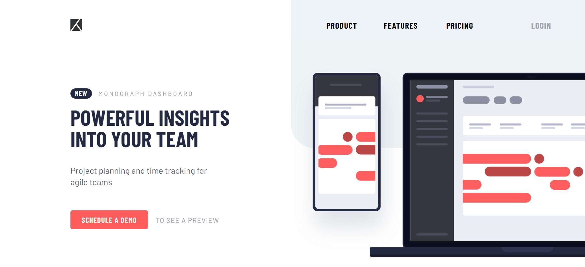

# Frontend Mentor - Project tracking intro component solution

This is a solution to the [Project tracking intro component challenge on Frontend Mentor](https://www.frontendmentor.io/challenges/project-tracking-intro-component-5d289097500fcb331a67d80e). Frontend Mentor challenges help you improve your coding skills by building realistic projects. 

## Table of contents

- [Overview](#overview)
  - [The challenge](#the-challenge)
  - [Screenshot](#screenshot)
  - [Links](#links)
- [My process](#my-process)
  - [Built with](#built-with)
  - [What I learned](#what-i-learned)
  - [Continued development](#continued-development)
  - [Useful resources](#useful-resources)
- [Author](#author)

## Overview

### The challenge

Users should be able to:

- View the optimal layout for the site depending on their device's screen size
- See hover states for all interactive elements on the page
- Create the background shape using code

### Screenshot



### Links

- Solution URL: [GitHub repository](https://github.com/h0ldemslav/frontend-mentor-challenges/tree/master/junior/project-tracking-intro-component-master)
- Live Site URL: [GitHub Pages](https://h0ldemslav.github.io/frontend-mentor-challenges/junior/project-tracking-intro-component-master/)

## My process

### Built with

- Semantic HTML5 markup
- CSS3
- SASS
- [BEM](https://en.bem.info/methodology/quick-start/) (only CSS)
- Mobile-first workflow
- JavaScript

### What I learned

In this challenge I've used SASS for the first time and learned how to use partials, variables and maps, mixins. I've also learned how to create shapes. Below is a code snippet:

```scss
// Shape with bottom left rounded corner behind the bg image (achieved with ChatGPT help)
&::before {
    content: "";
    background-color: utils.$light-grayish-blue;
    width: 50%;
    height: 55%;
    border-bottom-left-radius: 50px;
    position: absolute;
    top: 0;
    right: 0;
    z-index: -1;
}
```

### Continued development

As always I would like to focus more on CSS and JavaScript to create fancy and useful interfaces in the future. Also, I want to deepen my knowledge about using [SASS](https://sass-lang.com) and [BEM](https://en.bem.info/methodology/quick-start/).

### Useful resources

- [HTML validator](https://validator.w3.org/#validate_by_input)
- [CSS validator](https://jigsaw.w3.org/css-validator/validator.html.en#validate_by_input)
- [MDN docs](https://developer.mozilla.org/en-US/)
- [CSS Tricks](https://css-tricks.com)

## Author

- GitHub - [h0ldemslav](https://github.com/h0ldemslav)
- Frontend Mentor - [@h0ldemslav](https://www.frontendmentor.io/profile/h0ldemslav)
