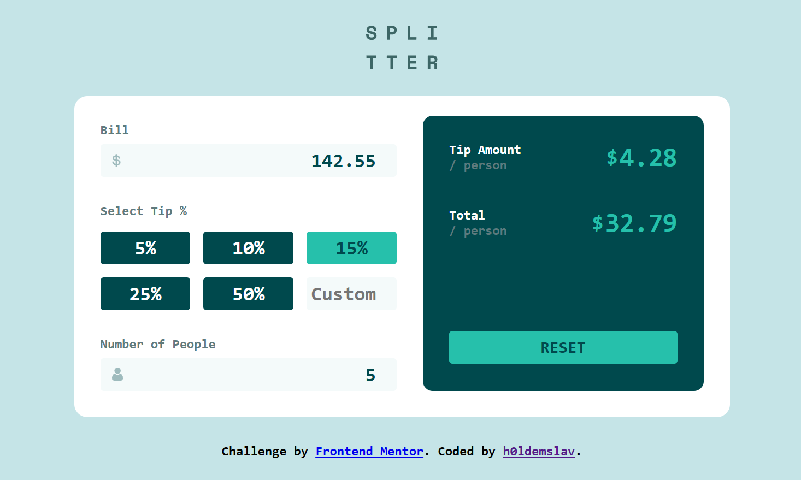

# Frontend Mentor - Tip calculator app solution

This is a solution to the [Tip calculator app challenge on Frontend Mentor](https://www.frontendmentor.io/challenges/tip-calculator-app-ugJNGbJUX). Frontend Mentor challenges help you improve your coding skills by building realistic projects.

## Table of contents

- [Overview](#overview)
  - [The challenge](#the-challenge)
  - [Screenshot](#screenshot)
  - [Links](#links)
- [My process](#my-process)
  - [Built with](#built-with)
  - [What I learned](#what-i-learned)
  - [Continued development](#continued-development)
  - [Useful resources](#useful-resources)
- [Author](#author)

## Overview

### The challenge

Users should be able to:

- View the optimal layout for the app depending on their device's screen size
- See hover states for all interactive elements on the page
- Calculate the correct tip and total cost of the bill per person

### Screenshot

### Links

- Solution URL: [Add solution URL here](https://your-solution-url.com)
- Live Site URL: [Add live site URL here](https://your-live-site-url.com)

## My process

### Built with

- Semantic HTML5 markup
- CSS3
- [React](https://reactjs.org/)
- [BEM](https://en.bem.info/methodology/quick-start/)
- Mobile-first workflow

### What I learned

First time I've tried React for Frontend Mentor challenge. Most intricate parts was state handling and creating/nesting components, because I had some doubts, if I should create a new component or not.

### Continued development

As always I would like to focus more on CSS and JavaScript to create fancy and useful web interfaces in the future. Also, I would like to continue to learn React and use it more often to get a better grasp.

### Useful resources

- [HTML validator](https://validator.w3.org/#validate_by_input)
- [CSS validator](https://jigsaw.w3.org/css-validator/validator.html.en#validate_by_input)
- [MDN docs](https://developer.mozilla.org/en-US/)
- [CSS Tricks](https://css-tricks.com)
- [React reference](https://react.dev/reference/react)

## Author

- GitHub - [h0ldemslav](https://github.com/h0ldemslav)
- Frontend Mentor - [@h0ldemslav](https://www.frontendmentor.io/profile/h0ldemslav)